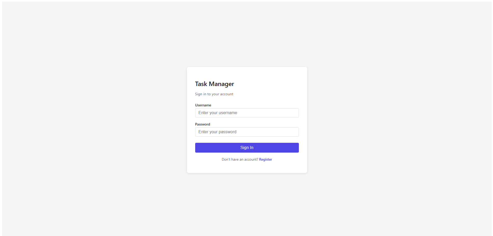
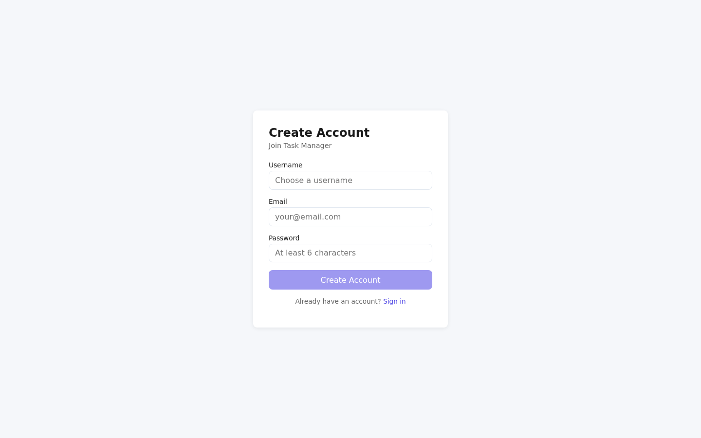

# Task Manager

A full-stack project management application built with Spring Boot 3.2.4 (backend) and React 18 + Vite (frontend).

**Live frontend:** https://taskmanagerapp-tau.vercel.app/
**Live backend:** https://task-manager-api-oej2.onrender.com/ (free tier — sleeps after 15 min inactivity)

> The frontend and backend are both live. First request after sleep takes 30–50 s to wake.

## Screenshots

**Login page (live frontend):**



**Registration page (live frontend):**



> The dashboard and other authenticated pages require the backend to be deployed. See [Deploying the Backend](#deploying-the-backend) below.

- **Backend:** REST API with JWT authentication, Spring Security, BCrypt, H2 (dev) / PostgreSQL (prod), Swagger UI, and Maven build.
- **Frontend:** Single-page application with React Router, context-based auth state, and Vite proxy for local development.

---

## Features

- User registration and login with JWT-based authentication
- Create, read, update, and delete projects
- Create, read, update, and delete tasks within projects
- Protected routes — unauthenticated users are redirected to login
- Development proxy so the frontend calls the backend seamlessly on `localhost:8080`
- Swagger UI at `/swagger-ui.html` (disabled in the `prod` profile)

---

## Tech Stack

### Backend
- Java 17
- Spring Boot 3.2.4
- Spring Security + Spring Web
- JJWT 0.12.5 (JWT creation and validation)
- BCrypt password hashing
- H2 Database (dev) / PostgreSQL (prod)
- Maven 3.9+
- SpringDoc OpenAPI (Swagger UI)

### Frontend
- React 18
- Vite 5
- React Router v6
- Built-in auth context and API helper

---

## Project Structure

```
task-manager/
├── backend/
│   └── spring-boot/
│       ├── pom.xml
│       ├── mvnw / mvnw.cmd          # Maven wrapper
│       ├── .mvn/wrapper/            # Wrapper jar + properties
│       └── src/
│           ├── main/
│           │   ├── java/.../taskmanager/
│           │   │   ├── TaskManagerApplication.java
│           │   │   ├── controller/     # REST endpoints
│           │   │   ├── dto/            # Request/response objects
│           │   │   ├── entity/         # JPA entities
│           │   │   ├── repository/     # Data access
│           │   │   ├── security/       # JWT + Spring Security config
│           │   │   └── service/        # Business logic
│           │   └── resources/
│           │       └── application.properties
│           └── test/                   # Unit tests
│       └── target/                     # Build output (gitignored)
├── frontend/
│   └── react/
│       ├── package.json
│       ├── vite.config.js             # Dev proxy + prod API URL
│       ├── src/
│       │   ├── main.jsx
│       │   ├── App.jsx
│       │   ├── api.js                 # Fetch helper
│       │   ├── context/
│       │   │   └── AuthContext.jsx    # Auth state + API calls
│       │   ├── pages/                 # Route components
│       │   └── components/
│       └── dist/                      # Production build (gitignored)
└── README.md
```

---

## Running Locally

### Prerequisites
- Java 17 (JDK)
- Maven 3.9+ (or use the Maven wrapper — see below)
- **Node.js 18+** and npm (for the frontend)

### Backend

```bash
cd backend/spring-boot

# Using the Maven wrapper (recommended — downloads Maven automatically on first run)
./mvnw clean compile
./mvnw spring-boot:run

# Or with a global Maven installation:
mvn clean compile
mvn spring-boot:run
```

The backend starts on `http://localhost:8080`. Swagger UI is available at `http://localhost:8080/swagger-ui.html`.

#### Environment variables (optional)

| Variable | Default | Description |
|---|---|---|
| `JWT_SECRET` | `change-me-in-production-min-32-characters-long` | Secret key for signing JWT tokens. **Set this in production.** |
| `JWT_EXPIRATION_MS` | `86400000` (24 hours) | Token validity period in milliseconds. |
| `CORS_ALLOWED_ORIGINS` | `http://localhost:5173` | Comma-separated list of allowed frontend origins. |
| `SPRING_DATASOURCE_URL` | (H2 in-memory) | JDBC URL for the database. |
| `SPRING_DATASOURCE_USERNAME` | `sa` | Database username. |
| `SPRING_DATASOURCE_PASSWORD` | (empty) | Database password. |

When `SPRING_DATASOURCE_URL` is not set, the application uses an embedded H2 database. Set these variables (or use `application-prod.properties`) to switch to PostgreSQL in production.

### Frontend

```bash
cd frontend/react

# Install dependencies (already done if node_modules exists)
npm install

# Start the development server (includes the Vite proxy to the backend)
npm run dev
```

The frontend opens on `http://localhost:5173` and proxies `/api/*` requests to `http://localhost:8080`.

For production builds:

```bash
npm run build
```

The built files are output to `frontend/react/dist/`. Set `VITE_API_URL` to the deployed backend URL when building for production, otherwise it falls back to `http://localhost:8080`.

---

## API Endpoints

### Authentication

| Method | Path | Description |
|---|---|---|
| `POST` | `/api/auth/register` | Register a new user |
| `POST` | `/api/auth/login` | Login and receive a JWT token |

All authenticated endpoints require the `Authorization` header with the JWT.

### Projects

| Method | Path | Description |
|---|---|---|
| `GET` | `/api/projects` | List all projects (authenticated) |
| `POST` | `/api/projects` | Create a new project |
| `GET` | `/api/projects/{id}` | Get a project by ID |
| `PUT` | `/api/projects/{id}` | Update a project |
| `DELETE` | `/api/projects/{id}` | Delete a project |

### Tasks

| Method | Path | Description |
|---|---|---|
| `GET` | `/api/tasks/project/{projectId}` | List tasks for a project |
| `POST` | `/api/tasks` | Create a new task |
| `GET` | `/api/tasks/{id}` | Get a task by ID |
| `PUT` | `/api/tasks/{id}` | Update a task |
| `DELETE` | `/api/tasks/{id}` | Delete a task |

### Health

| Method | Path | Description |
|---|---|---|
| `GET` | `/api/health` | Health check (no auth required) |

---

## Security

- Passwords are hashed with BCrypt before storage.
- JWT tokens are signed with HS256. Set a strong `JWT_SECRET` in production.
- Spring Security protects all endpoints except `/api/auth/**`, `/api/health`, and `/h2-console/**`.
- Swagger UI and API docs are disabled when the `prod` profile is active.

---

## Deployment

### Frontend (already deployed)
Live at https://taskmanagerapp-tau.vercel.app/ (auto-deploys from `main`).

To redeploy manually:
```bash
cd frontend/react
VITE_API_URL=https://<your-backend>.onrender.com npm run build
# Upload frontend/react/dist/ to your static host
```

### Deploying the Backend

**Prerequisites**: a [Render](https://render.com) account and this repo forked to your GitHub.

#### Option A — Blueprint deploy (recommended)
Render will read `render.yaml` from the repo and create both the Web Service and PostgreSQL DB in one click:

1. Go to <https://render.com/deploy?repo=https://github.com/FrozenProduction/task-manager>
2. Sign in to Render (it will fork the repo if needed)
3. Render shows a blueprint preview with two resources:
   - `task-manager-api` (Web Service, Java, free plan)
   - `task-manager-db` (PostgreSQL, free plan)
4. Click **Apply**. Render will:
   - Create the database, generate credentials
   - Wire `DB_HOST`, `DB_PORT`, `DB_NAME`, `DB_USERNAME`, `DB_PASSWORD` env vars to point at it
   - Build and deploy the API
5. After deploy, copy the URL (e.g. `https://task-manager-api-xxxx.onrender.com`)
6. **Update the frontend**: set `VITE_API_URL` in Vercel env vars and trigger a redeploy, OR add it to a fresh `vercel.json` env block and push.
7. Edit `CORS_ALLOWED_ORIGINS` in the Render dashboard to your actual frontend URL (e.g. `https://taskmanagerapp-tau.vercel.app`). The default in `render.yaml` already allows `*.vercel.app`.
8. **Replace `JWT_SECRET`** in the Render dashboard with a freshly generated secret. `render.yaml` ships a placeholder, but Render will treat the file as immutable once the service is created — change it in the dashboard after the first deploy.

#### Option B — manual Render setup
1. Create a PostgreSQL database on Render (free plan, name `task-manager-db`).
2. Create a Web Service:
   - **Runtime**: Java
   - **Build command**: `./mvnw clean package -DskipTests`
   - **Start command**: `java -jar target/task-manager-api-1.0.0.jar`
   - **Root directory**: `backend/spring-boot`
   - **Plan**: free
3. Set environment variables:
   - `SPRING_PROFILES_ACTIVE=prod`
   - `JWT_SECRET=<your-strong-secret>` — generate with `python -c "import secrets;print(secrets.token_urlsafe(48))"`
   - `CORS_ALLOWED_ORIGINS=https://taskmanagerapp-tau.vercel.app`
   - `DB_HOST=<from-DB-info>` (Internal Database Hostname)
   - `DB_PORT=5432`
   - `DB_NAME=<from-DB-info>` (Internal Database Name)
   - `DB_USERNAME=<from-DB-info>`
   - `DB_PASSWORD=<from-DB-info>`
4. Deploy.

#### Render free-tier caveats
- Web services sleep after **15 min of inactivity**. First request after sleep takes ~30-50 s to wake.
- Free PostgreSQL expires after **90 days** of inactivity (Render will email before this).
- For a portfolio piece this is acceptable; for production, upgrade to a paid plan.

---

## Recent Changes

- **Frontend `AuthContext.jsx`**: fixed `Authorization` header — was producing `"BARerv <token>"` (wrong prefix from `atob("QkFSZXJ2")`) instead of `"Bearer <token>"`. This was silently causing every authenticated request to 403. Now uses a template literal: `Bearer ${stored}`.
- **Frontend `vite.config.js`**: dev server port corrected from `5174` → `5173` to match the README.
- **Backend `TaskService.updateTask`**: removed unreachable nested null check inside an outer non-null check.
- **CI**: added `.github/workflows/test.yml` — runs `mvn package` + `test_backend.sh` on every push/PR.
- **Integration tests**: added `test_backend.sh` covering 14 scenarios (health, register, login, bad password, unauthenticated, project CRUD, task CRUD, ownership).

---

## License

MIT
