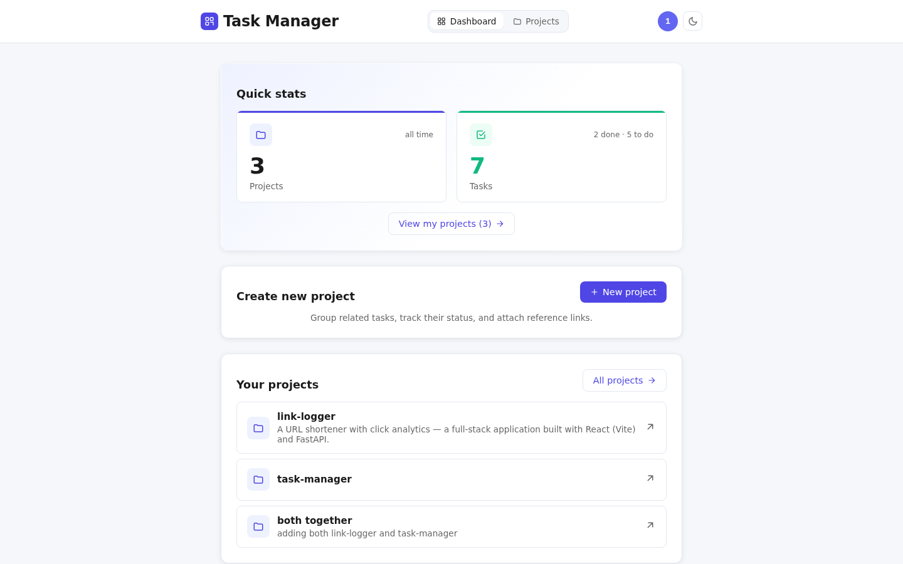
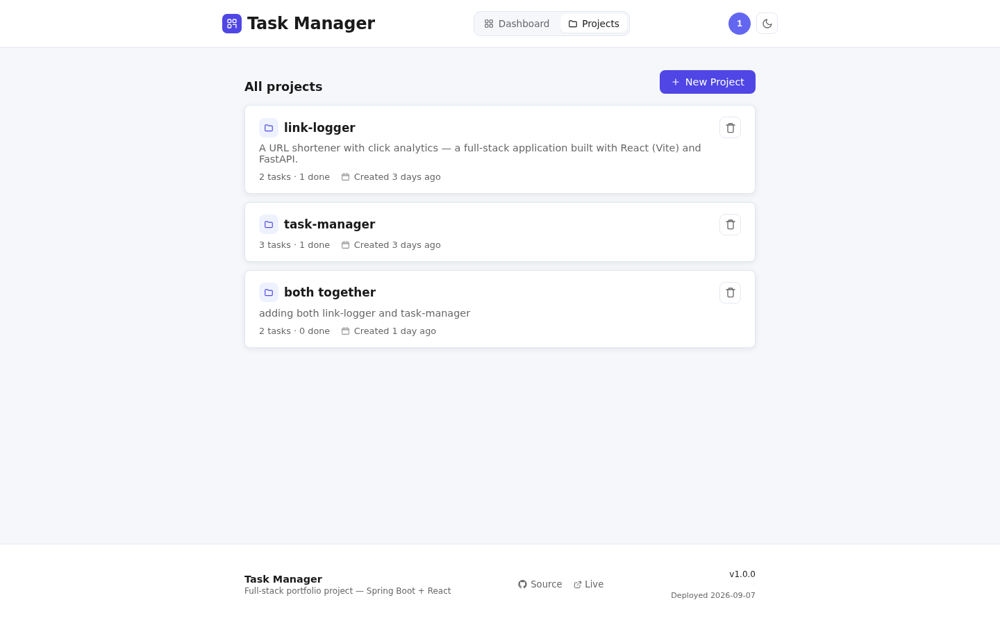
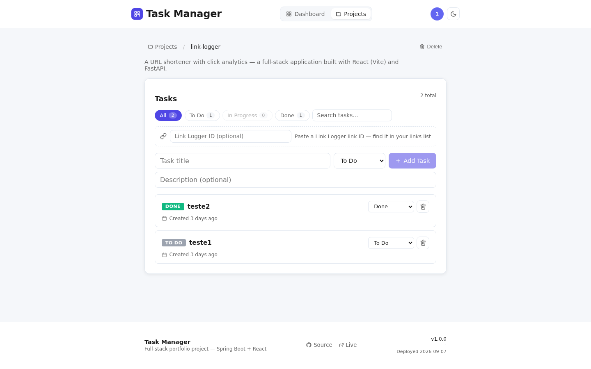

# Task Manager


A full-stack project management app. Spring Boot 3.2 REST API with JWT auth, React 18 + Vite SPA with dark mode. Projects hold tasks with status tracking, search, and per-project progress. Tasks can optionally attach a link from [Link Logger](https://link-logger-pink.vercel.app/), fetched server-to-server and snapshotted onto the task.

**Live frontend:** https://taskmanagerapp-tau.vercel.app/
**Live backend:** https://task-manager-api-oej2.onrender.com/ (free tier — sleeps after 15 min inactivity; first request after sleep takes ~30–50 s to wake)

> Try it instantly — demo account: username `123`, password `123456`.

## Screenshots

**Dashboard:**



**Projects:**



**Project detail (tasks, filters, link attach):**



**Login:**


**Registration:**


---

## Features

- User registration and login with JWT authentication (BCrypt-hashed passwords)
- Create, read, update, and delete projects; per-project task lists
- Task statuses (To Do / In Progress / Done) with filter chips, counts, and search
- Dashboard with live totals from a single aggregated `GET /api/tasks/stats` query
- **Link Logger attach**: pass `linkLoggerLinkId` when creating a task and the backend fetches the link server-to-server, snapshotting short code, URL, and click count onto the task
- User profile editing (username/email/password) with fresh JWT re-issue
- Dark mode (system preference + persisted toggle), responsive layout
- Protected routes — unauthenticated users are redirected to login
- Plain-text API errors the UI renders directly (`Invalid username or password`, `Project not found`, `Access denied`)
- Flyway migrations (baseline + versioned) for production schema evolution

## Link Logger Integration

Task Manager and [Link Logger](https://link-logger-pink.vercel.app/) are two
independent services in this portfolio. This feature connects them so a task
can reference a previously-shortened link.

**Flow:**

```
┌────────────┐   linkLoggerLinkId    ┌──────────────────┐   GET /api/links/{id}   ┌──────────────┐
│  Browser   │ ────────────────────▶ │ Task Manager API │ ──────────────────────▶ │ Link Logger  │
│ (Vercel)   │                       │  (Render)        │                         │   API        │
└────────────┘                       └──────────────────┘                         └──────────────┘
        ▲                                       │                                        │
        │                                       │  snapshots short_code,                 │
        │                                       │  original_url, clicks onto Task        │
        │                                       ▼                                        │
        │                              ┌──────────────────┐                              │
        └──────────── TaskDto ─────────│   PostgreSQL     │                              │
                  (with link fields)   └──────────────────┘                              │
```

**Design decisions worth calling out:**

- **Server-to-server, not browser-to-browser.** The browser never calls
  Link Logger directly. Link Logger's CORS permits only its own Vercel
  origin, not Task Manager's Vercel origin, so a browser-side lookup
  would fail. The Task Manager backend calls Link Logger as an HTTP
  client (`LinkLoggerClient` in `service/`), where CORS doesn't apply.
- **Snapshot, not foreign key.** When a task is created from a link,
  the link's `short_code`, `original_url`, and `clicks` are *copied*
  onto the Task row at creation time. Subsequent renders don't fan
  out to Link Logger on every page load, and the task survives even
  if the source link is deleted in Link Logger later. The trade-off
  is that the click count becomes a snapshot — accurate as of the
  moment of import, not live.
- **Public-by-design.** Link Logger has no authentication, so the
  client needs no token, no header, and no secret. If Link Logger
  ever adds auth, `LinkLoggerClient` is the only place that needs
  to change.
- **Failure is loud.** If Link Logger is unreachable (cold start,
  5xx, timeout) or returns 404, the user gets a 400/503 via
  `ApiException` — the task is *not* created silently without the
  link. The user can retry. We chose this over "save the task
  anyway and attach nothing" because the surprise factor of an
  unattached task is worse than the friction of a retry.

**What I'd do differently at scale:**

- Real-time click counts via webhooks from Link Logger → Task Manager
  (push instead of snapshot).
- Shared identity layer (SSO) so the user doesn't have to maintain
  accounts on both services.
- Circuit breaker + cache in front of `LinkLoggerClient` so the
  free-tier cold-start doesn't surface as a 503 to the user.

---

## Tech Stack

### Backend
- Java 17
- Spring Boot 3.2.4
- Spring Security + Spring Web
- JJWT 0.12.5 (JWT creation and validation)
- BCrypt password hashing
- Spring Data JPA + Hibernate
- Flyway (baseline + versioned migrations in `db/migration/`)
- H2 Database (dev) / PostgreSQL (prod)
- Maven 3.9+ (wrapper included)
- SpringDoc OpenAPI (Swagger UI, dev only)

### Frontend
- React 18
- Vite 5
- React Router v6
- Context-based auth state + shared API helper
- Dark mode via CSS variables + `localStorage`

---

## Project Structure

```
task-manager/
├── backend/
│   └── spring-boot/
│       ├── pom.xml
│       ├── mvnw / mvnw.cmd          # Maven wrapper
│       └── src/
│           └── main/
│               ├── java/.../taskmanager/
│               │   ├── TaskManagerApplication.java
│               │   ├── config/         # Prod DataSource (env-based)
│               │   ├── controller/     # REST endpoints
│               │   ├── dto/            # Request/response objects
│               │   ├── entity/         # JPA entities
│               │   ├── exception/      # ApiException + handler (400/403 text errors)
│               │   ├── repository/     # Data access
│               │   ├── security/       # JWT filter + Security chain
│               │   └── service/        # Business logic + LinkLoggerClient
│               └── resources/
│                   ├── application.properties       # Defaults (all profiles)
│                   ├── application-prod.properties  # Prod overrides
│                   └── db/migration/                # Flyway migrations
├── frontend/
│   └── react/
│       ├── package.json
│       ├── vite.config.js             # Dev proxy + prod API URL
│       └── src/
│           ├── main.jsx
│           ├── App.jsx
│           ├── context/
│           │   └── AuthContext.jsx    # Auth state + API hooks
│           ├── hooks/                 # useTheme
│           ├── utils/                 # formatStatus, formatDate, avatarColor
│           ├── pages/                 # Route components
│           └── components/
├── .github/workflows/test.yml         # Backend build + integration tests
├── test_backend.sh                    # 12-scenario API smoke test
├── test_link_logger.sh                # Link attach smoke test
├── render.yaml                        # Render blueprint (web service)
└── README.md
```

---

## Running Locally

### Prerequisites
- Java 17 (JDK)
- Maven 3.9+ (or use the Maven wrapper — see below)
- **Node.js 18+** and npm (for the frontend)

### Backend

```bash
cd backend/spring-boot

# Using the Maven wrapper (recommended — downloads Maven automatically on first run)
./mvnw clean package -DskipTests
java -jar target/task-manager-api-1.0.0.jar

# Or run directly (skips the jar step)
./mvnw spring-boot:run
```

The backend starts on `http://localhost:8080` with an H2 in-memory database (no setup needed). Swagger UI is available at `http://localhost:8080/swagger-ui.html`.

#### Environment variables

| Variable | Default | Description |
|---|---|---|
| `PORT` | `8080` | HTTP port (Render injects its own). |
| `JWT_SECRET` | dev-only placeholder | Secret key for signing JWT tokens. **Set a strong value in production.** |
| `JWT_EXPIRATION_MS` | `86400000` (24 hours) | Token validity period in milliseconds. |
| `CORS_ALLOWED_ORIGINS` | `http://localhost:5173` | Comma-separated list of allowed frontend origins (patterns, e.g. `https://*.vercel.app`). |
| `SPRING_PROFILES_ACTIVE` | (none — H2 dev) | Set to `prod` for PostgreSQL. |
| `SPRING_FLYWAY_ENABLED` | `false` | Set to `true` in prod so Flyway baselines + migrates the existing schema. |
| `DB_HOST` / `DB_PORT` / `DB_NAME` / `DB_USERNAME` / `DB_PASSWORD` | (none) | PostgreSQL connection parts, read by `DataSourceConfig` in the `prod` profile. |
| `LINK_LOGGER_API_URL` | `http://localhost:8000` | Link Logger API base for server-to-server fetches. |
| `LINK_LOGGER_PUBLIC_BASE_URL` | `http://localhost:5173` | Public base used to build clickable short URLs. |

### Frontend

```bash
cd frontend/react

npm install
npm run dev
```

The frontend opens on `http://localhost:5173` and proxies `/api/*` requests to `http://localhost:8080`.

For production builds:

```bash
VITE_API_URL=https://<your-backend>.onrender.com npm run build
```

The built files are output to `frontend/react/dist/` (gitignored). Without `VITE_API_URL`, production builds fall back to the deployed Render URL baked into `vite.config.js`.

---

## API Endpoints

All authenticated endpoints take `Authorization: Bearer <token>`. A `401` logs the user out client-side with a "Session expired" message. Client errors return plain text (`Invalid username or password`, `Project not found`, `Access denied`); validation failures return `400` with field details.

### Authentication

| Method | Path | Auth | Description |
|---|---|---|---|
| `POST` | `/api/auth/register` | No | Register a new user, returns token |
| `POST` | `/api/auth/login` | No | Login, returns token |
| `GET` | `/api/auth/me` | Yes | Current user profile |
| `PATCH` | `/api/auth/me` | Yes | Update username/email/password (requires `currentPassword`, re-issues token) |

### Projects

| Method | Path | Description |
|---|---|---|
| `GET` | `/api/projects` | List own projects |
| `POST` | `/api/projects` | Create a new project |
| `GET` | `/api/projects/{id}` | Get a project by ID |
| `PATCH` | `/api/projects/{id}` | Update a project |
| `DELETE` | `/api/projects/{id}` | Delete a project and its tasks |

### Tasks

| Method | Path | Description |
|---|---|---|
| `GET` | `/api/tasks/project/{projectId}` | List tasks for a project |
| `POST` | `/api/tasks` | Create a task (`linkLoggerLinkId` optional) |
| `GET` | `/api/tasks/{id}` | Get a task by ID |
| `PATCH` | `/api/tasks/{id}` | Update a task (title/description/status/assignee) |
| `DELETE` | `/api/tasks/{id}` | Delete a task |
| `GET` | `/api/tasks/mine` | All own tasks across projects |
| `GET` | `/api/tasks/assigned` | Tasks assigned to the current user |
| `GET` | `/api/tasks/stats` | `{total, todo, inProgress, done}` in one query |

### Health

| Method | Path | Description |
|---|---|---|
| `GET` | `/api/health` | Health check (no auth required) |

---

## Security

- Passwords are hashed with BCrypt before storage.
- JWT tokens are signed with HS256. Set a strong `JWT_SECRET` in production (Render dashboard only — never in the repo).
- Spring Security protects everything except `POST /api/auth/**`, `/api/health`, docs, and the error dispatcher. Unauthenticated API calls return `403`.
- `AccessDeniedException` paths (cross-user project/task access) return `403` with a message; client-fixable errors return `400` with a message; genuine server bugs stay `500`.
- Swagger UI and API docs are disabled when the `prod` profile is active.
- No secrets are committed: `.env`, `*.db`, build output, and credentials live outside the repo (see `.gitignore`). Verified across full git history.

---

## Deployment

### Frontend (deployed)

Live at https://taskmanagerapp-tau.vercel.app/ (auto-deploys from `main`).

### Backend (deployed)

Live at https://task-manager-api-oej2.onrender.com/ (free tier, auto-deploys from `main`).

**Setup notes (already done, for reproduction):**
- The PostgreSQL database (`task-manager-db`) was created manually on Render; `render.yaml` therefore declares only the Web Service and references the DB via `fromDatabase`.
- After the service is created, set in the Render dashboard: `JWT_SECRET`, `SPRING_PROFILES_ACTIVE=prod`, `SPRING_FLYWAY_ENABLED=true`, `DB_HOST/DB_PORT/DB_NAME/DB_USERNAME/DB_PASSWORD` (from the DB info tab), `CORS_ALLOWED_ORIGINS`, and the two `LINK_LOGGER_*` URLs. Blueprint-declared values are immutable on re-deploy, so dashboard values win — add new keys there manually.
- First prod startup with Flyway baselines the existing schema, then applies `V2__add_task_source_link_columns.sql`.

#### Render free-tier caveats
- Web services sleep after **15 min of inactivity**. First request after sleep takes ~30-50 s to wake.
- Free PostgreSQL expires after **90 days** of inactivity (Render emails before this).
- For a portfolio piece this is acceptable; for production, upgrade to a paid plan.

---

## Tests

- **CI** (`.github/workflows/test.yml`): on backend changes, builds the jar, boots it against H2, and runs the integration suite. Badge at the top reflects `main`.
- **`test_backend.sh`**: 12 scenarios (health, register, login, bad password, unauthenticated, project CRUD, task CRUD, cross-user access).
- **`test_link_logger.sh`**: set `API_URL` and run — registers a temp user, creates a link in Link Logger, attaches it to a task, verifies the snapshot badge fields.

```bash
bash test_backend.sh                                  # against local :8080
API_URL=https://task-manager-api-oej2.onrender.com bash test_link_logger.sh
```

---

## License

MIT
